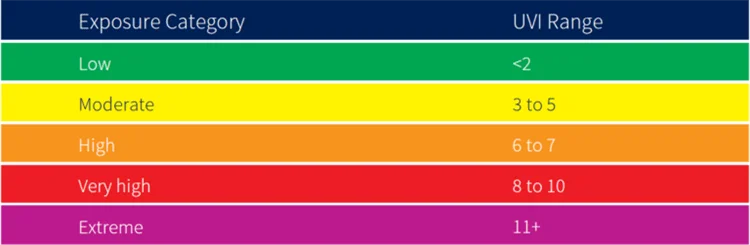

# Robert (Scott) Sterling: Weather Dashboard App

## Description

This application utilizes HTML, CSS, jQuery, and the OpenWeatherMap API to generate a weather dashboard.

### Summary of Features

When a world city is entered into the input field, and Search is clicked, the current weather conditions populate in the primary section, with details including temperature, wind speed, humidity percentage, and the ultraviolet index.

The UV index colors are based on the following global chart:

The click evennt also triggers a five-day forecast for the given city, indicated in the five cards underneath the current weather. The temperatures in the 5-day forecast are broken into the day's high and low.

Anytime a city is searched, the city name is added to the sidebar as a button. I attempted to add a click event that would have recalled that city's weather information, but I could not accomplish that aspect.

Watch a video of the action:

Link to deployed application: https://overnightsolo.github.io/weather-challenge-6/
